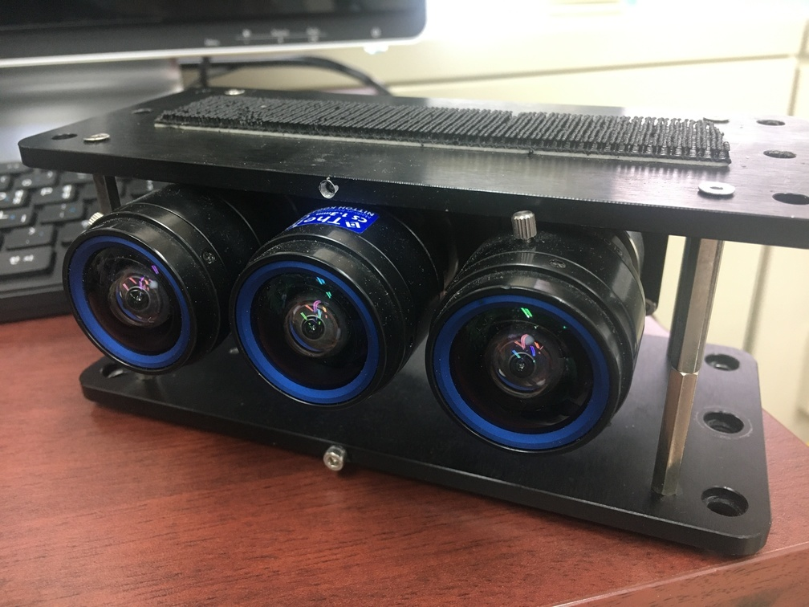

# Proactive Camera Attribute Control using Bayesian Optimization

This Github repo is for a proactive camera controller. We control two main camera attributes: exposure time (shutter speed) and gain simultaneously. The overall procedure consists of three modules,

* image synthesis module
* metric evaluation module
* control module module


We provide Matlab and C/C++ code. Since this code is to control a camera, the code should be compiled together with the camera driver. In this sample code, we implement our controller code with Bluefox camera driver.

In the experiment, we have used a sensor rig consists of three bluefox cameras ().



Cite our work via

> @ARTICLE{jwkim-2020-tro,<br>
> author={J. Kim and Y. Cho and A. Kim},<br>
> journal={IEEE Transactions on Robotics},<br>
> title={Proactive Camera Attribute Control Using Bayesian Optimization for Illumination-Resilient Visual Navigation},<br>
> year={2020},<br>
> note={Accepted. In print.}}

The author version of the paper can be downloaded in this [link](https://irap.kaist.ac.kr/index.php/Main/Publication?action=bibentry&bibfile=ref.bib&bibref=jwkim-2020-tro).


# Matlab

Matlab folder contains the following subfolders.

* **controller**<br>
  Run `exp_gain_controller` to run with sample images.
* **synthetic**<br>
  Run `run_synth_gen` to synthesize using a sample image.
* **data**<br>
  This folder contains sample images.
* **fcns_synth** and **fcns_gp**<br>
  These folders contain libraries to run camera control and synthesis.

Matlab scripts illustrate how the algorithm works using sample images. In the Matlab examples, we do not ***control*** the camera.

# C/C++

To effectively use this camera controller, the algorithm should run begin coupled with the camera driver. In this sample code, we show how to use with Bluefox camera driver. Thus some code has a high dependency with the `Bluefox2Driver`, but you are welcome to adjust the code to couple with your own camera driver.

The `src` folder contains C/C++ code to run camera controller.

* **crf_fitting**<br>
  Given four images, we fit a CRF curve.
* **gpgo**<br>
  Using Gaussian Process Global Optimzer, compute optimal exposure time and gain.
* **data_collector**<br>
  Image collector using `Bluefox2Driver`.
* **exp_ctrl**<br>
  This contains the main executable camera exposure controller. Similar functionality as in tester code except it captures an image from the camera directly using `Bluefox2Driver`.
* **irp_imgeval++** and **irp_gpgo++**<br>
  Image evaluation and camera attribute control library.


## Dependency (Pre-installation)

### 1) OpenCV

We have tested the code using `OpenCV 3.4.0`. You can skip this steps if you have `OpenCV 3.4.0` or higher installed.

```
mkdir opencv
cd opencv
wget -O opencv.zip https://github.com/opencv/opencv/archive/3.4.0.zip
wget -O opencv_contrib.zip https://github.com/opencv/opencv_contrib/archive/3.4.0.zip
unzip opencv.zip
unzip opencv_contrib.zip
cd opencv-3.4.0
```

Compile OpenCV

```
mkdir build
cd build
cmake -D CMAKE_BUILD_TYPE=RELEASE \
-D CMAKE_INSTALL_PREFIX=/usr/local \
-D WITH_TBB=OFF \
-D WITH_IPP=OFF \
-D WITH_1394=OFF \
-D BUILD_WITH_DEBUG_INFO=OFF \
-D BUILD_DOCS=OFF \
-D INSTALL_C_EXAMPLES=ON \
-D INSTALL_PYTHON_EXAMPLES=ON \
-D BUILD_EXAMPLES=OFF \
-D BUILD_TESTS=OFF \
-D BUILD_PERF_TESTS=OFF \
-D WITH_QT=OFF \
-D WITH_GTK=ON \
-D WITH_OPENGL=ON \
-D OPENCV_EXTRA_MODULES_PATH=../../opencv_contrib-3.4.0/modules \
-D WITH_V4L=ON \
-D WITH_FFMPEG=ON \
-D WITH_XINE=ON \
-D BUILD_NEW_PYTHON_SUPPORT=ON \
-D PYTHON2_INCLUDE_DIR=/usr/include/python2.7 \
-D PYTHON2_NUMPY_INCLUDE_DIRS=/usr/lib/python2.7/dist-packages/numpy/core/include/ \
-D PYTHON2_PACKAGES_PATH=/usr/lib/python2.7/dist-packages \
-D PYTHON2_LIBRARY=/usr/lib/x86_64-linux-gnu/libpython2.7.so \
-D PYTHON3_INCLUDE_DIR=/usr/include/python3.6m \
-D PYTHON3_NUMPY_INCLUDE_DIRS=/usr/lib/python3/dist-packages/numpy/core/include/ \
-D PYTHON3_PACKAGES_PATH=/usr/lib/python3/dist-packages \
-D PYTHON3_LIBRARY=/usr/lib/x86_64-linux-gnu/libpython3.6m.so \
../
make
```

Install OpenCV

```
sudo make install
sudo sh -c echo '/usr/local/lib/' > sudo /etc/ld.so.conf.d/opencv.conf
sudo ldconfig
```

### 2) Bluefox2Driver

Goto third-party and install the driver.

```
cd third-party
./install_mvBlueFOX.sh
```

Also you need to install lcm since our driver relies on [lcm](https://lcm-proj.github.io/).

```
unzip lcm-1.4.0.zip
cd lcm-1.4.0/
mkdir build
cd build
cmake ..
make
sudo make install
```

## Camera Controller Compile and Installation

You can use the following commands to download and compile the package.

```
mkdir build
cd build
cmake ..
make
```

## Running binary files

The main executable file is `exp_ctrl` while others are the testers.

### 1) exp_ctrl

The main exposure (exposure time and gain) controller. It may crash because this binary assumes a bluefox camera is on the system. First, prepare your config file.

```
cd config
ln -s bluefox2-2122.json master.json
```

Then run the binary file.
```
./exp_ctrl
```

We have included our `master.json` file for the bluefox camera.

### 2) exp_ctrl_1step

Using captured images, control exposure for a single image.

```
./exp_ctrl_1step
```

### 3) crf_fitting

Example of generating camera response function (CRF) and saved in csv format.

```
./crf_fitting
```

### 4) gp_gain_tester

Test GP based controller for camera gain.
```
./gp_gain_tester
```


### 5) gp_exp_tester

Test GP based controller for camera exposure time.
```
./gp_exp_tester
```

### 6) img_synthesizer

Example of creating synthetic images for exposure time and gain. By running, it shows image synthesizing process.
```
./img_synthesizer <image filename>
```
For example, you can run with the sample data attached.
```
./img_synthesizer ../../data/3.png
```

### 7) img_evaluator

It shows evaluation metric computed from image gradient and entropy.
```
./img_evaluator <image filename>
```
