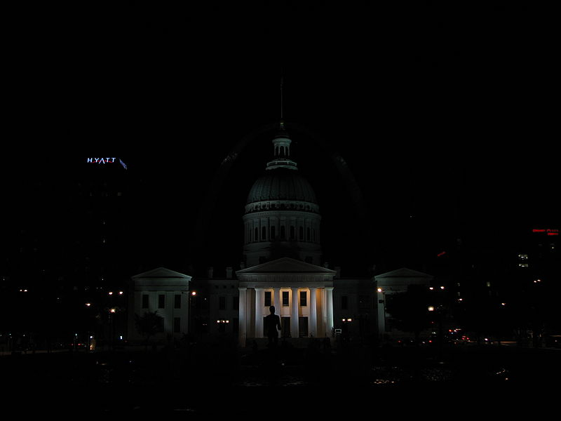
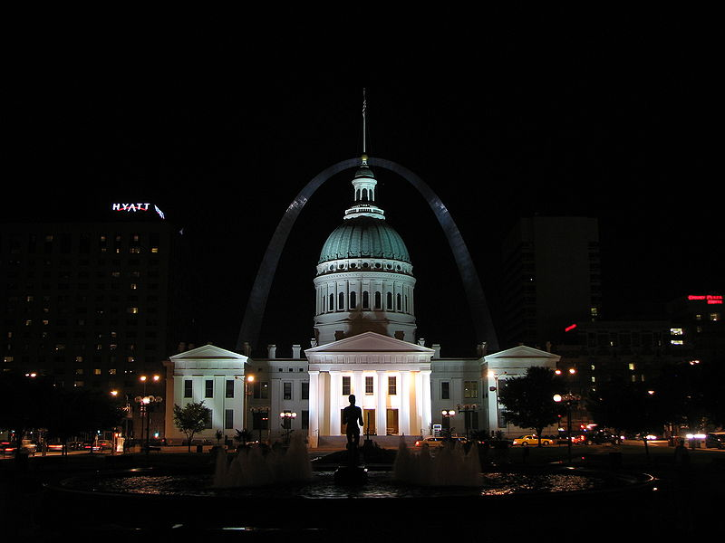
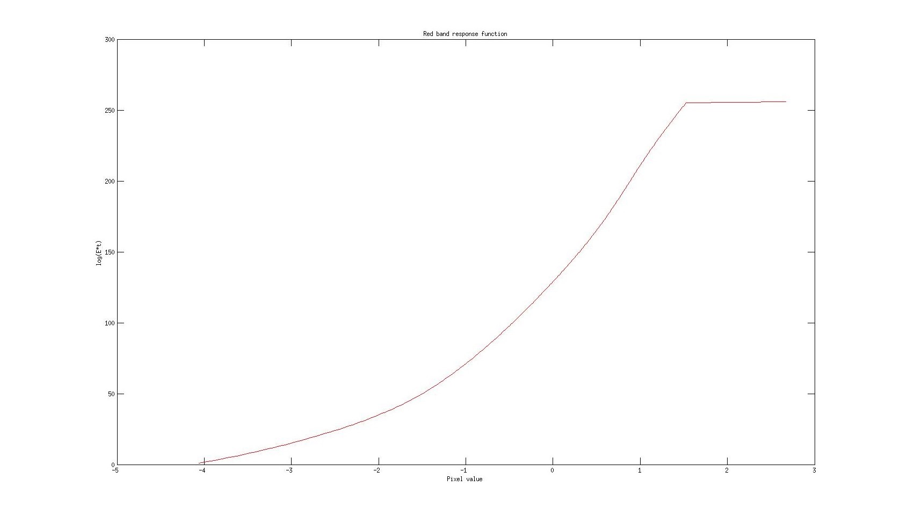
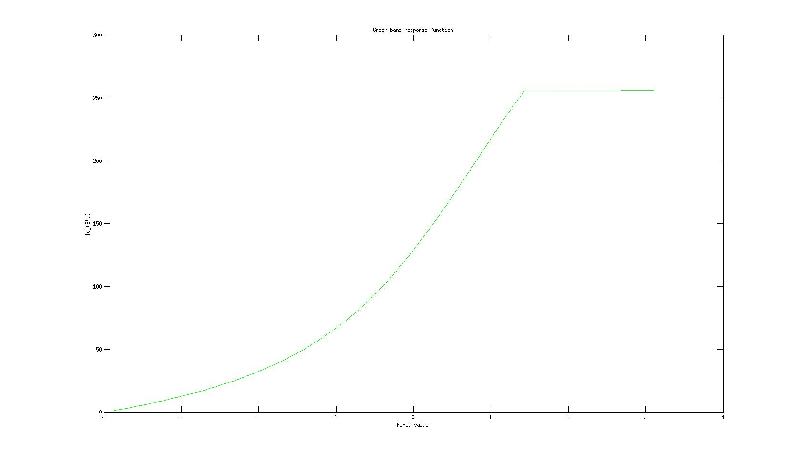
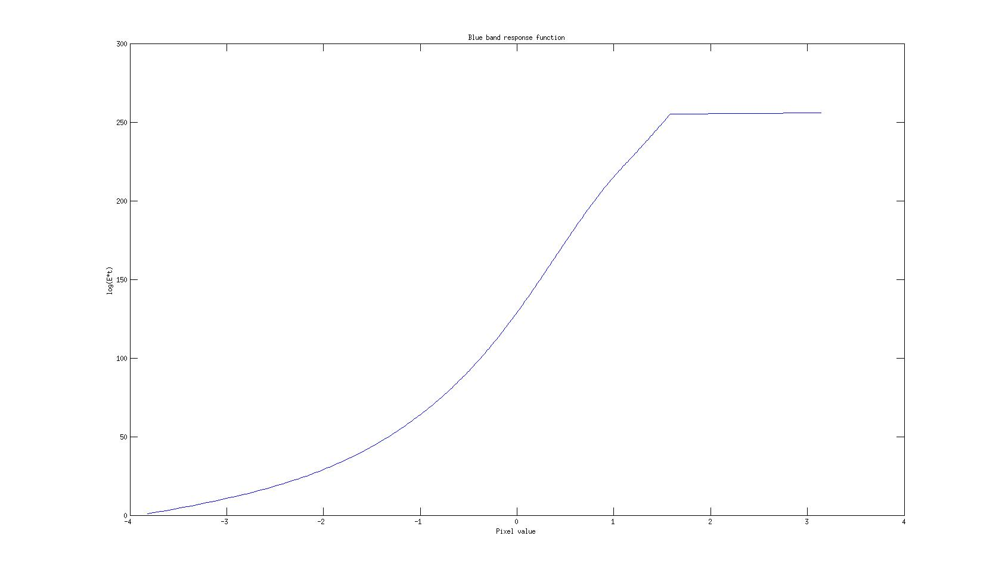
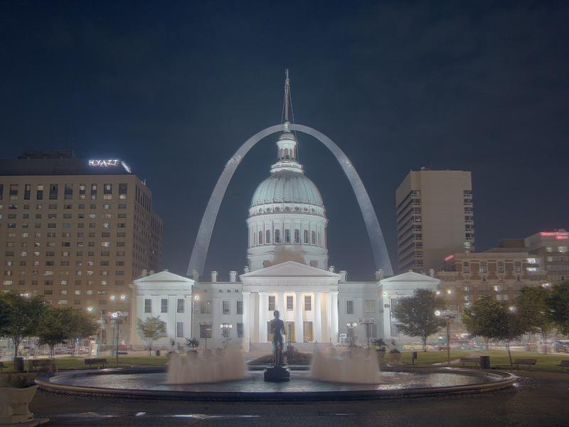

Debevec Paper practice
=====
Paper url: http://www.pauldebevec.com/Research/HDR/debevec-siggraph97.pdf

Used Images.
=====      

   

Response functions.    
=====

Red band

Green band

Blue band

Result Images.
=====

Raw tone mapped image.

   
Tone mapped image with local histogram equalization.

